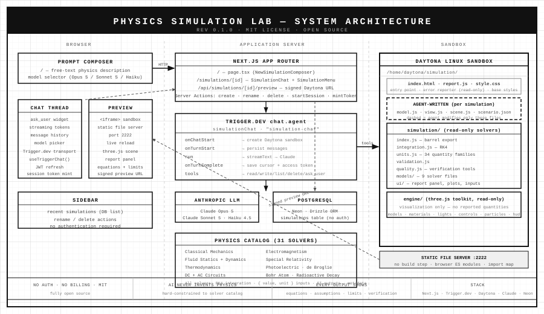

# Physics Simulation Lab

An open-source, AI-powered physics simulation environment. Describe a physical scenario in plain language — the phenomenon, geometry, values, and units — and the AI agent writes a live browser simulation grounded in real, validated physics. Every simulation displays its governing equations, assumptions, limitations, and verification status alongside the results.

Built for engineers verifying hypotheses before committing to real designs, and for students building physical intuition.

[](LICENSE)

---



---

## What it does

You type a description of a physical scenario. The agent:

1. **Classifies** the request — educational simulation, preliminary engineering analysis, conceptual visualization, or unsupported
2. **Asks** for any missing inputs — one question at a time, never inventing values
3. **Calls** a validated solver from the physics catalog
4. **Writes** a browser simulation with the result, governing equations, assumptions, and limitations displayed beside the conversation

The simulation runs live in the browser. Every turn the agent edits a file, the preview reloads. There is no sign-in, no credit system, and no billing.

---

## Physics catalog

The agent is **hard-constrained** to this catalog. It cannot write its own physics, improvise equations, or produce numbers outside these models. 31 solvers across 6 domains.

### Classical mechanics

| Solver | Model |
|---|---|
| `solveKinematics1D` | Constant-acceleration SUVAT — any 3 of 5 quantities |
| `solveNewtonSecondLaw` | F = ma — any 2 of 3 quantities + weight |
| `solveDragForce` | Stokes drag (bv) and quadratic drag (½ρC_D Av²) + RK4 trajectory |
| `solveFriction` | Coulomb friction — flat and inclined surfaces |
| `solveImpulseMomentum` | Impulse-momentum theorem + elastic / inelastic / perfectly-inelastic collisions |
| `solveWorkEnergy` | Work, KE, ΔKE, gravitational PE, spring PE, power |
| `solveAngularKinematics` | Rotational SUVAT with constant α — tangential and centripetal |
| `solveTorque` | τ = Iα, angular momentum, rotational KE, rolling-without-slip |
| `solveMomentOfInertia` | 8 catalog shapes + parallel-axis theorem |
| `solveProjectileMotion` | 2D projectile motion (no drag) |
| `solveFreeFall` | Vertical free fall with optional linear Stokes drag |
| `solveCircularMotion` | Uniform circular motion + optional banked-turn analysis |
| `solveSimplePendulum` | Exact nonlinear equation of motion (RK4) |
| `solvePhysicalPendulum` | Rigid body on fixed pivot (RK4) |
| `solveSpringMass` | 1-DOF free and forced vibration (RK4) |
| `solveSimplySupportedBeam` | Euler-Bernoulli SSB — central point load or UDL |

### Fluid mechanics

| Solver | Model |
|---|---|
| `solveFluidStatics` | Hydrostatic pressure profile + Archimedes buoyancy |
| `solveContinuity` | Conservation of mass — A₁v₁ = A₂v₂ |
| `solveBernoulli` | Bernoulli equation — inviscid incompressible steady flow |
| `solveHagenPoiseuille` | Viscous laminar pipe flow (Re < 2300) |
| `solveReynoldsNumber` | Re classification — pipe, flat plate, sphere |
| `solveStokesSettling` | Terminal settling velocity of a sphere (Re ≪ 1) |
| `solveDragCoefficient` | Form drag F_D = ½ρC_D Av² |
| `solveVenturiMeter` | Venturi flow meter — ideal or real (discharge coeff) |

### Thermodynamics

| Solver | Model |
|---|---|
| `solveIdealGasProcess` | Ideal gas — isothermal, isobaric, isochoric, adiabatic |
| `solveThermalExpansion` | Linear thermal expansion ΔL = α L₀ ΔT |

### Circuits

| Solver | Model |
|---|---|
| `solveOhmLaw` | Ohm's law V = IR, resistor networks (series / parallel) |
| `solveRCCircuit` | Series RC transient — charge / discharge |
| `solveRLCircuit` | Series RL transient — current growth / decay |
| `solveRLCCircuit` | Free RLC series oscillation — Q factor, regime |

### Electromagnetism

| Solver | Model |
|---|---|
| `solveCoulombsLaw` | Coulomb force, electric field, potential, PE |
| `solveElectricField` | Point-charge field or uniform parallel-plate field |
| `solveCapacitor` | Parallel-plate geometry / network / direct: C, Q, V, energy |
| `solveLorentzForce` | F = qvB (particle) and F = ILB (wire) + cyclotron r/f |
| `solveBiotSavart` | B on-axis of circular loop; B inside solenoid |
| `solveFaradayLaw` | Flux change, motional EMF (BLv), inductor back-EMF |
| `getMaxwellEquations` | All four Maxwell equations — integral and differential form |

### Modern physics

| Solver | Model |
|---|---|
| `solveSpecialRelativity` | γ, β, relativistic p and E, time dilation, length contraction |
| `solvePhotoelectricEffect` | Einstein model — KE_max = hf − Φ, stopping potential |
| `solveDeBroglie` | de Broglie wavelength λ = h/p |
| `solveBohrAtom` | Bohr hydrogen atom — energy levels, radii, spectral lines |
| `solveRadioactiveDecay` | Exponential decay N(t) = N₀ e^(−λt) |
| `solveComptonScattering` | Compton wavelength shift Δλ = (h/m_e c)(1−cosθ) |

All solvers live in [`lib/physics-lab/runtime/simulation/`](lib/physics-lab/runtime/simulation/) as plain browser ES modules — no build step, no bundler, runs directly in the Daytona sandbox.

---

## Architecture

```
Browser
├── / — NewSimulationComposer
└── /simulations/[id] — SimulationChat (resizable split: thread | preview iframe)
         │
         │  HTTP (Server Actions, Trigger.dev transport)
         ▼
Next.js App Router (app/)
├── page.tsx                     — home
├── simulations/[id]/page.tsx    — simulation view
├── api/simulations/[id]/preview — signed Daytona preview URL
└── Server Actions               — create · rename · delete · startSession · mintToken
         │
         │  Trigger.dev SDK
         ▼
Trigger.dev  chat.agent  "simulation-chat"
├── onChatStart    — createSimulationSandbox (Daytona)
├── onTurnStart    — persist messages (PostgreSQL)
├── run            — streamText → Claude (Opus 5 / Sonnet 5 / Haiku 4.5)
├── onTurnComplete — save cursor + access token
└── tools          — read_file · write_file · replace_text · list_files · delete_file · ask_user
         │
         │  Daytona SDK
         ▼
Daytona Linux Sandbox  /home/daytona/simulation/
├── index.html, report.js, style.css  (seeded, read-only)
├── model.js, view.js, scenario.json  (agent-written, per simulation)
├── simulation/                       (read-only validated solvers)
│   ├── models/   — 9 solver files (classical-mechanics, electromagnetism, …)
│   ├── ui/       — report panel, plots, numeric inputs
│   ├── index.js  — barrel export (31 solvers + utilities)
│   ├── integration.js, quality.js, units.js, validation.js
└── engine/                           (three.js rendering toolkit, read-only)
         ▲
         │  signed preview URL → iframe
Browser Preview
```

---

## Stack

| Layer | Technology |
|---|---|
| Framework | Next.js 16 (App Router) |
| Database | PostgreSQL via [Neon](https://neon.tech) + Drizzle ORM |
| AI runtime | [Trigger.dev](https://trigger.dev) `chat.agent` + Vercel AI SDK `streamText` |
| LLM | Anthropic Claude (Opus 5 / Sonnet 5 / Haiku 4.5) |
| Sandbox | [Daytona](https://daytona.io) (Linux sandboxes, static file server on :2222) |
| 3D rendering | [three.js](https://threejs.org) (via import map, no bundler) |
| Observability | Sentry |
| UI | shadcn/ui + Tailwind CSS |

---

## Getting started

### Prerequisites

- Node.js 20+
- A [Neon](https://neon.tech) PostgreSQL database
- An [Anthropic](https://console.anthropic.com) API key
- A [Trigger.dev](https://trigger.dev) project
- A [Daytona](https://daytona.io) API key

### Environment variables

Copy `.env.example` to `.env.local` and fill in:

```bash
# Database (Neon)
DATABASE_URL=postgresql://...

# AI
ANTHROPIC_API_KEY=sk-ant-...

# Trigger.dev
TRIGGER_SECRET_KEY=tr_...

# Daytona
DAYTONA_API_KEY=...

# Sentry (optional)
SENTRY_DSN=https://...
SENTRY_ORG=...
SENTRY_PROJECT=...
SENTRY_AUTH_TOKEN=...
```

### Install and run

```bash
npm install

# Push the database schema (no migrations — dev only)
npm run db:push

# Start the Next.js dev server
npm run dev

# In a separate terminal, start the Trigger.dev dev worker
npm run trigger:dev
```

Open [http://localhost:3000](http://localhost:3000).

### Run tests

```bash
npm run test:simulation
```

The solver tests run directly in Node.js against the ES module files — no browser required. All 49 tests pass.

---

## Project structure

```
app/
├── (app)/
│   ├── layout.tsx               — sidebar layout (no auth)
│   ├── page.tsx                 — home page (prompt composer)
│   └── simulations/[id]/
│       └── page.tsx             — simulation view
├── api/simulations/[id]/preview/
│   └── route.ts                 — serves signed Daytona preview URL
└── layout.tsx                   — root layout

components/
├── simulation-chat.tsx          — resizable split view (thread | preview)
├── simulation-menu.tsx          — rename / delete
├── new-simulation-composer.tsx  — home page prompt input
├── chat-thread.tsx              — conversation panel + model picker
├── chat-preview.tsx             — simulation iframe
└── app-sidebar.tsx              — sidebar with recent simulations

lib/
├── physics-lab/                 — core domain logic
│   ├── actions.ts               — server actions (create, rename, delete)
│   ├── agent.ts                 — model settings per Claude version
│   ├── authorize.ts             — simple ownership check (no auth)
│   ├── chat-actions.ts          — Trigger.dev session server actions
│   ├── chat-session.ts          — session cleanup on delete
│   ├── chat-store.ts            — thread persistence (load/save)
│   ├── instructions/            — agent system prompt
│   │   ├── workflow.ts          — physics constraints + full catalog docs
│   │   ├── runtime.ts           — sandbox layout + solver API
│   │   └── engine.ts            — three.js toolkit reference
│   ├── model-catalog.ts         — model IDs and taglines
│   ├── models.ts                — Anthropic provider instances
│   ├── queries.ts               — DB read functions
│   ├── runtime/                 — sandbox seed files (uploaded to Daytona)
│   │   ├── simulation/          — physics solvers (browser ES modules)
│   │   │   ├── models/          — 9 solver files
│   │   │   ├── ui/              — report panel, plots, numeric inputs
│   │   │   ├── index.js         — barrel export (31 solvers + utilities)
│   │   │   ├── integration.js   — RK4 integrator
│   │   │   ├── quality.js       — error / convergence analysis
│   │   │   ├── units.js         — 34 quantity families, unit conversion
│   │   │   └── validation.js    — field validation helpers
│   │   └── engine/              — three.js rendering toolkit
│   ├── seed.ts                  — reads runtime/ for upload to Daytona
│   ├── suggestions.ts           — home-page prompt suggestions (10 scenarios)
│   ├── title.ts                 — title length cap + truncation
│   └── tools.ts                 — agent tool definitions (file I/O + ask_user)
├── daytona/                     — sandbox create / start / delete
├── db/                          — Drizzle schema + client (simulations table)
└── billing/                     — step cost tracking only (no credit gates)

trigger/
└── chat.ts                      — simulationChat durable agent task

tests/
└── simulation/                  — Node.js unit tests (49 tests, 0 failures)

public/
└── architecture.svg             — system architecture diagram
```

---

## Adding a physics solver

1. **Write the solver** in `lib/physics-lab/runtime/simulation/models/your-model.js` as a plain browser ES module.
   - Accept `{ value, unit }` quantity objects for every physical input.
   - Return SI values only. Convert at the edges with `convertUnit` or `convertTemperature`.
   - Export a `YOUR_MODEL_METADATA` constant with `id`, `name`, `assumptions`, `governingEquation(s)`, and `outputUnits`.
   - Throw on bad input — never return `NaN` or a silent default.

2. **Export from the barrel** [`lib/physics-lab/runtime/simulation/index.js`](lib/physics-lab/runtime/simulation/index.js).

3. **Add units** for any new physical quantity to [`lib/physics-lab/runtime/simulation/units.js`](lib/physics-lab/runtime/simulation/units.js).

4. **Document the solver** in the physics catalog section of [`lib/physics-lab/instructions/workflow.ts`](lib/physics-lab/instructions/workflow.ts) and in the import example in [`lib/physics-lab/instructions/runtime.ts`](lib/physics-lab/instructions/runtime.ts).

5. **Add a suggestion** to [`lib/physics-lab/suggestions.ts`](lib/physics-lab/suggestions.ts).

6. **Write tests** under `tests/simulation/` and run `npm run test:simulation`.

---

## Agent constraints

The agent prompt enforces strict physics integrity. The agent **cannot**:

- Invent a physical input, constant, or governing equation
- Write a physics solver outside `simulation/`
- Use `engine/physics.js` to produce a reported quantity (it is unverified arcade physics)
- Violate, approximate around, or otherwise break a conservation law
- Claim a result is safe, certified, or code-compliant
- Display a number without its unit
- Apply a default silently — every default must be offered explicitly and confirmed

Any request for physics outside the catalog receives an honest refusal and, where appropriate, an offer of a clearly labelled conceptual visualization.

---

## Contributing

Contributions welcome. The most useful additions are new validated physics solvers — see *Adding a physics solver* above.

Please ensure:
- New solvers include unit tests under `tests/simulation/`
- The governing equations, assumptions, and limitations are documented in the solver file itself
- The solver throws on invalid input rather than returning a sentinel value
- All 49 existing tests continue to pass (`npm run test:simulation`)

---

## License

[MIT](LICENSE)
